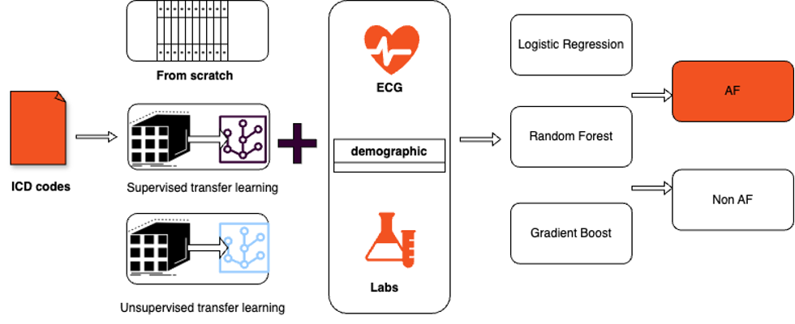

# Enhanced-Atrial-Fibrillation-Prediction-in-ESUS-Patients-with-Pre-training-and-Transfer-Learning
**Keywords:** Atrial fibrillation, ESUS, Hypergraph learning, Pre-training, Transfer learning

## Project Summary
This repo explores **Atrial Fibrillation (AF) prediction** in **ESUS** patients using **pre-training + transfer learning** on hypergraphs. We first learn patient representations on a large stroke cohort (AI-RESPECT, *n* = 7,780), then transfer compact embeddings to a smaller ESUS cohort (*n* = 510) for downstream AF prediction with lightweight ML models.

---

## Task Description
**Goal:** Predict whether an ESUS patient will develop AF (binary classification).

- **Challenges:** small target cohort, high-dimensional diagnostic features (ICD), risk of overfitting.
- **Inputs:** 
- Baseline clinical features (58 dims)
- Diagnostic features (ICD; up to 1,529 dims for ESUS)
- **Output:** AF risk (0/1)

---

## Method Overview
We represent patient data as a **hypergraph**: nodes = diagnostic features; hyperedges = patient visits/encounters. We then learn **hyperedge (patient) embeddings** and transfer them to ESUS.

### 1) From-Scratch (Baseline)
Concatenate clinical + diagnostic features:
- `x_i = x_{i,b} ⊕ x_{i,d}`
- Trains directly on ESUS; simple but prone to overfitting in small-N, high-D.

### 2) Supervised Transfer
Pre-train a **hypergraph transformer** on AI-RESPECT (labeled PSCI task) and transfer:
- Learn final hyperedge embedding as a **32-D patient vector**.
- Build ESUS features by `x_i = x_{i,tr} ⊕ x_{i,b}` and train AF classifiers (LR/RF/GB).

### 3) Unsupervised Transfer
Pre-train on AI-RESPECT **without labels** via two components, then transfer:
- **Hypergraph View Augmentation (genSim):** 
- Node masking biased by duplication; hyperedge selection via **Gumbel-Softmax**.
- Consistency objectives across two augmented views: `L_genSim = L_hyper + L_sim`.
- **Triplet Contrastive Learning (Trip):**
- **Node-level**, **hyperedge-level**, and **membership-level** contrasts across augmented graphs.
- Total loss: `L_total = L_genSim + L_n + L_e + L_m` (equal weights).
- Extract a **32-D** patient embedding and concatenate with clinical features as above.

<p align="center">
  
</p>
<p align="center">
<em>Overview of our proposed framework for AF prediction in ESUS patients</em>
</p>

---

## Why Hypergraphs?
Hypergraphs naturally capture **many-to-many** relations between features and visits, enabling attention-based message passing:
- Within-hyperedge (V→E) and within-node (E→V) self-attention propagate information between **features** and **patient encounters**.
- Produces compact, expressive **patient embeddings** for downstream AF prediction.

---
## Data

This project leverages **electronic health record (EHR)** data from the Emory Healthcare System, combining two cohorts for **pre-training** and **transfer learning**:

- **ESUS Dataset (Target Cohort)**  
- 510 patients diagnosed with **Embolic Stroke of Undetermined Source (ESUS)** between *Jan 1, 2015 – Dec 13, 2023*  
- 107 developed **post-stroke AF** as a first occurrence  
- Inclusion criteria: ≥18 years old, no prior stroke within 5 years before 2015, and no history of AF before index stroke  
- Features:  
- **58 baseline clinical variables**: demographics, biomarkers, echocardiographic, ECG features, comorbidities  
- **1,529 diagnostic features**: 990 ICD-based + 539 medication-related  

- **AI-RESPECT Dataset (Pre-training Cohort)**  
- 7,780 stroke patients diagnosed between *Jan 1, 2012 – Dec 31, 2021*  
- 1,735 developed **post-stroke cognitive impairment (PSCI)**  
- Inclusion criteria: stroke diagnosis with no prior history of cognitive impairment  
- Features: **2,595 diagnostic features**, broader coverage of stroke-related medical history  

Across both datasets, **1,494 diagnostic features overlap**, covering 97.7% of ESUS diagnostic features, enabling effective pre-training transfer.

> ⚠️ **Note:** Both ESUS and AI-RESPECT datasets are **institutional EHR data** and not publicly available due to patient privacy. Access requires proper institutional approvals and IRB clearance.  
---
## Project Structure
---
## Usage

### Unsupervised Representation Learning for Hyperedges

#### Step 1: Feature Generation
Navigate to the `unsupervised_pretraining/scripts/` folder to generate initial hyperedge features:
- **Script**: `gen_feat.sh`
- **Description**: Runs random walks + Word2Vec to produce node embeddings and hyperedge feature representations.

#### Step 2: Overlapness and Homogeneity
After generating features, compute overlapness and homogeneity metrics:
- **Script**: `gen_overlap_homogeneity.sh`
- **Description**: Generates `overlapness` and `homogeneity` files for each dataset.
- **Note**: Place the generated files under the same folder as the corresponding dataset.

#### Step 3: Low-Dimensional Representation
Once the overlapness and homogeneity files are ready, run the training scripts to obtain low-dimensional hyperedge feature representations:
- **Scripts**:
- `spicd3.sh` – train on **separate ICD-3** dataset
- `spicd4.sh` – train on **separate ICD-4** dataset
- `cbicd3.sh` – train on **combined ICD-3** dataset
- `cbicd4.sh` – train on **combined ICD-4** dataset
- **Description**: Each script calls the transfer learning framework to pretrain and fine-tune on hypergraph datasets, producing compressed representations of hyperedge features.
- 
### Supervised Representation Learning for Hyperedges

#### Step 1: Feature Generation
As in the unsupervised setting, begin by generating features for each dataset.

#### Step 2: Low-Dimensional Representation
Navigate to the `supervised_pretraining` directory and run `train.py` to obtain low-dimensional feature representations for hyperedges.

- 
## Downstream Prediction

Two complementary runners are provided:

### Option A — Train & External Validate (save models + ROC figs)

**Script:** `/downstream_predicting/External_validation.py`

- **Train on main cohort (pick one embedding set per run)**

```bash
# Supervised embedding
python External_validation.py   --train-main   --main-baseline data/main/baseline.csv   --embed-supervised data/main/supervised.csv   --models-dir outputs/main/models   --figs-dir outputs/main/figs

# Unsupervised embedding(s)  (CSV or NPY; if multiple given, the first is used for training)
python External_validation.py   --train-main   --main-baseline data/main/baseline.csv   --embed-unsupervised data/main/unsup_a.csv data/main/unsup_b.csv   --models-dir outputs/main/models   --figs-dir outputs/main/figs
```

- **Predict on external cohort with saved models**

```bash
python External_validation.py   --predict-external   --external-baseline data/external/baseline.csv   --external-embed-unsupervised data/external/unsup_a.npy data/external/unsup_b.npy   --models-dir outputs/main/models   --figs-dir outputs/external/figs
```

- **Train + External Validate in one pass**

```bash
python External_validation.py   --train-main --predict-external   --main-baseline data/main/baseline.csv   --embed-supervised data/main/supervised.csv   --external-baseline data/external/baseline.csv   --external-embed-supervised data/external/supervised.csv   --models-dir outputs/main/models   --figs-dir outputs/external/figs
```

**Outputs:**  
- `outputs/main/models/{LR,RF,GB}.pkl` — full trained pipelines  
- `outputs/external/figs/<dataset>.png` — overlaid ROC curves  

---

### Option B — Cross-Validated Benchmarking (nested CV + GridSearch)

**Script:** `/downstream_predicting/ML_prediction.py`

```bash
python ML_prediction.py   --baseline data/main/baseline.csv   --supervised data/main/supervised.csv   --unsupervised data/main/unsup_a.csv data/main/unsup_b.csv   --results outputs/cv/results.csv   --outer-splits 5   --inner-splits 3   --seed 42
```

**Outputs:**  
- `outputs/cv/results.csv` with rows:
```
dataset,model,auc_mean,auc_std,f1_mean,f1_std
```

---

**Notes:**  
- `target` column must be present in baseline CSV.  
- Option A accepts unsupervised embeddings as **CSV or NPY**; Option B expects **CSV**.  
- To compare multiple embeddings with Opt---ion A, run multiple times with different `--models-dir`.
---
